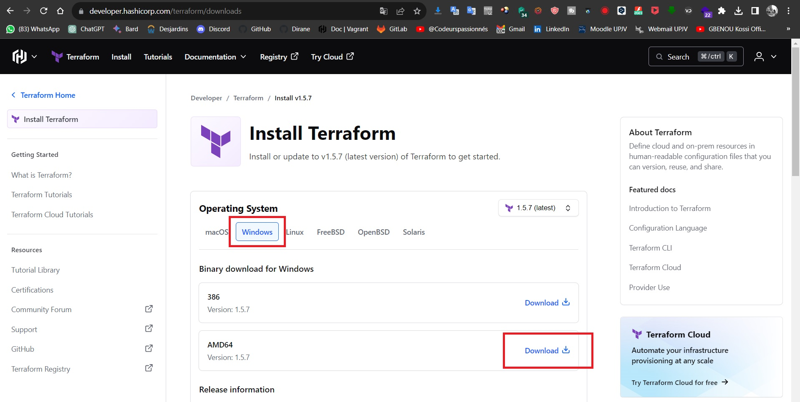
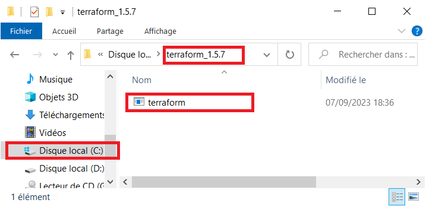
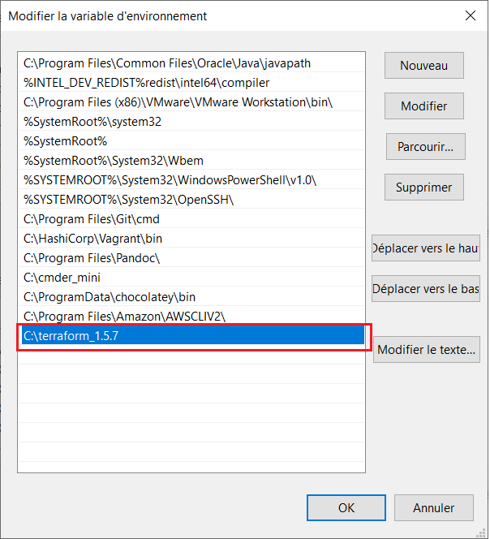
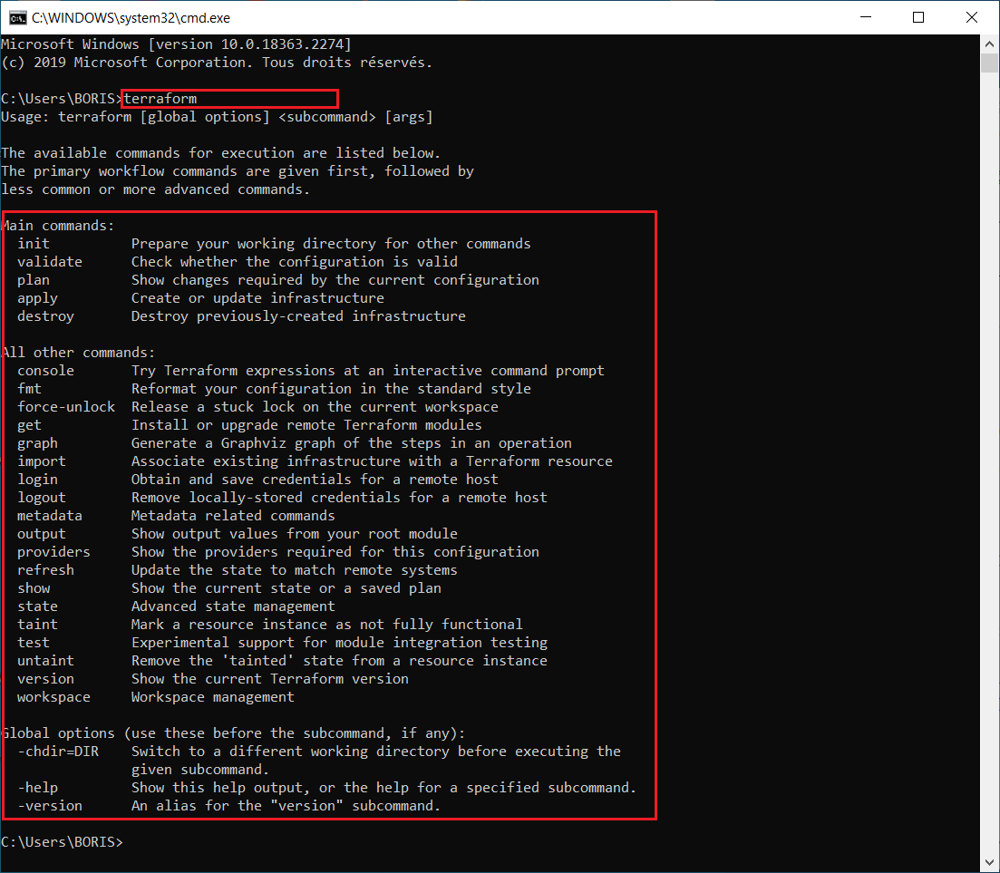

# TERRAFORM-TRAINING

# TP-1 : Installez terraform

- Installer Terraform en récupérant le binaire via le lien suivant https://www.terraform.io/downloads.html
- Si vous etes sous windows, copiez le binaire dans le dossier de votre disque dur system par exemple C:\terraform\, ensuite il vous faudra rajouter le répertoire précédent dans le PATH de votre système d'exploitation
- Si vous etes sous linux, vous pouvez le déplacer dans /usr/bin/ après l'avoir rendu exécutable
- Pour vérifier l'installation, veuillez juste entrez la commande terraform et l'aide apparaitra !

# STEP BY STEP WORKING

ici, moi je suis entrain de travailler sous Windows

- Je récupère le binaire en ligne

- Ensuite, je le dézipe dans le dossier `C:\terraform_1.5.7\`

- Ensuite, je rajouter le répertoire `C:\terraform_1.5.7\` dans le PATH de votre système d'exploitation

- Et en fin, je peux vérifier l'installation :

